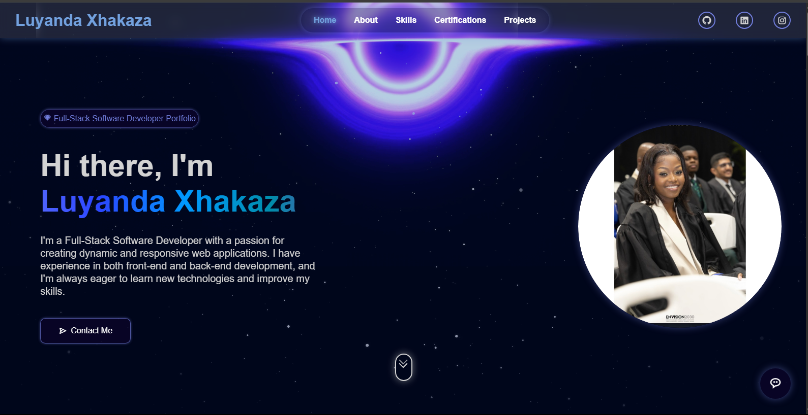

# Luyanda Xhakaza - Full-Stack Developer Portfolio



A modern, responsive portfolio website showcasing my skills, projects, and certifications as a Full-Stack Developer.

## Features

- 🌌 Interactive space-themed design with animated background
- 📱 Fully responsive layout for all device sizes
- 🎨 Gradient text animations and smooth transitions
- 📝 Contact form with Web3Forms integration
- 🤖 AI chatbot assistant powered by Chatbase
- 🏆 Certifications showcase with verification links
- 💻 Projects section with live demos

## Live Demo

✨ **Experience the portfolio live**: [https://luyandaaaa.github.io/Personal_Portfolio/public](https://luyandaaaa.github.io/Personal_Portfolio/public)

## Technologies Used

### Frontend
- HTML5, CSS3, JavaScript
- CSS Grid & Flexbox
- Boxicons for icons
- Animated gradients and transitions

### Backend (Contact Form)
- Web3Forms API for form submissions

### Deployment
- GitHub Pages

## Project Structure
```
/
├── LICENSE
├── README.md
├── assets/
│   ├── images/
│   │   ├── 1.png
│   │   ├── 2.png
│   │   ├── 3.png
│   │   ├── 5.png
│   │   ├── 6.png
│   │   ├── 7.png
│   │   ├── calculator.png
│   │   ├── digital brain.png
│   │   ├── heroImage.jpeg
│   │   ├── portfolio.png
│   │   ├── thumbnail.png
│   │   ├── todo.png
│   │   ├── User.png
│   │   └── weather.png
│   └── videos/
│       ├── blackhole.mp4
│       ├── desktop.ini
│       └── galaxy.mp4
└── public/
    ├── index.html
    ├── script.js
    └── styles.css
```


## 📜 License
Distributed under the MIT License. See LICENSE for more information.
